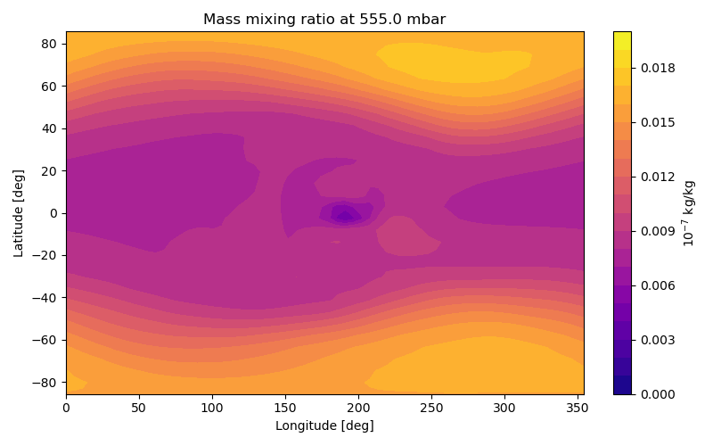

Running ExoPlaSim's aerosol module
==================================

ExoPlaSim's aerosol module allows the user to prescribe a 
source of either dust or photochemical haze in the planet's
atmosphere. The aerosol particles are transported by the
horizontal and vertical winds and settle under gravity. If
optical data is available, there is an option to include
the aerosols in the radiative transfer calculation
(absorption and scattering), incorporating their feedback on
the climate into the simulation.

The aerosol module can be controlled through the ExoPlaSim 
Python API in the configuration step. The arguments ``aerosol`` 
and ``aerorad`` turn on the aerosol transport and radiative 
transfer codes, respectively. For the aerosol radiative transfer, 
the model requires optical data to be read in from a .dat file. 
A Python script is available which inputs an ExoPlaSim-appropriate 
stellar spectrum and a complex refractive index of the aerosol 
and outputs a formatted .dat file containing the optical constants.

Configuration variables controlling the aerosol module
------------------------------------------------------

The free parameters controlling the aerosol run are:

    aerosol
        ``True`` turns on the aerosol transport scheme only. Default is ``False``.
    rhop
        A float specifying the density of the particles in kg/m3.
    apart
        A float specifying the radius of the particles in meters.
    asource
        The aerosol source. An integer that can take a value of ``1`` or ``2``.
        
        ``1`` places the source at the top model level and sets it proportional
        to either the cosine of the solar zenith angle (if radiative transfer is off)
        or the downward shortwave flux (if radiative transfer is on). This set-up
        represents a photochemical haze source.
        
        ``2`` places the source at the bottom level and switches it on wherever
        a gridbox contains land. This set-up represents a dust source.
    fcoeff
        A float that represents the prescribed mass mixing ratio (kg/kg)
        of the aerosol source.
        
        If ``asource`` is set to 1, this coefficient is multiplied by the
        cosine of the solar zenith angle or the downward shortwave flux.
        
        If ``asource`` is set to 2, this coefficient is multiplied by the
        binary land-sea mask.
    aerobulk
        An integer controlling the background gas. Options are:
        
        ``1``: nitrogen gas
        
        ``2``: hydrogen gas
        
        ``3``: carbon dioxide (untested)
    aerorad
        Integer. If set to ``1``, the aerosols are included in the radiative transfer calculation.
        Default is ``0`` (aerosol transport without radiative transfer).
    aerofile
        String. Path to a 8x1 (row x col) .dat file containing the aerosol 
        optical constants extinction efficiency, scattering efficiency, 
        backscattering efficiency, and asymmetry factor for the two shortwave bands.
        
Example configuration set-up
-----------------------------

Below is an example of how to use the configuration variables to set up
a simulation with aerosols:

>>> myModel.configure(aerosol=True, rhop=1000, apart=1000e-09, asource=1, 
                      fcoeff=10e-13, aerobulk=1, aerorad=1, 
                      aerofile=‘/home/user/exoplasimproject/hazeconstants/titanconstants.dat’)

This creates particles of density 1000 kg/m3 (equivalent to soot) and 
radius 1000 nm (1 um), with a photochemical source at the top of the atmosphere and 
an initial source similar to the haze production rate per second in Titan’s 
upper atmosphere. The background gas is nitrogen and the aerosol radiative effects 
are switched on. The optical constants are from laboratory measurements of Titan's
photochemical organic haze.

Incorporating these aerosol settings into the simulation of TOI-700d set up in
the tutorial would look like this:

>>> toi700d.configure(startemp=3480.0, flux=1167.0,                           # Stellar parameters
>>>                   eccentricity=0.,obliquity=0.,fixedorbit=True,           # Orbital parameters
>>>                   synchronous=True,rotationperiod=37.426,                 # Rotation
>>>                   radius=1.19,gravity=11.9,aquaplanet=True,               # Bulk properties
>>>                   pN2=1.47*(1-360e-6),pCO2=1.47*360e-6,ozone=False,       # Atmosphere
>>>                   timestep=15.0,snapshots=720,physicsfilter="gp|exp|sp",  # Model dynamics
>>>                   aerosol=True,rhop=1000,apart=1000e-09,asource=1,        # Aerosol properties
>>>                   fcoeff=10e-13,aerobulk=1,aerorad=1,
>>>                   aerofile=‘/home/user/exoplasimproject/hazeconstants/titanconstants.dat’)
>>> toi700d.exportcfg()

Running the aerosol module typically requires reducing the timestep for numerical
stability (here to 15 minutes). 

Module output
----------------------------------

The output of the aerosol module is a 4-D data cube called 'mmr' 
(for mass mixing ratio) and is in units of kg/kg. Here's a visualisation
of an example output, from a simulation of TRAPPIST-1 e:

The plot shows higher concentrations of haze particles at the high latitudes
near the eastern terminator (lon 270), where the particles collect in standing Rossby
gyres. The equator is comparatively free of haze.

Generating new optical constants
----------------------------------

The hazeconstants folder in the exoplasim package directory already 
contains haze constants from `(He et al. 2023) <https://arxiv.org/ftp/arxiv/papers/2301/2301.02745.pdf>`_ for a 300K water-rich atmosphere 
calculated for GJ677c, TRAPPIST-1e, and Wolf 1061c for 10 different particle sizes.
The existing .dat files assume an N2 atmosphere (refractive index 1.00029, aka 1).
The haze constants were calculated using the Python package `MiePython <https://miepython.readthedocs.io/en/latest/>`_
assuming spherical haze particles. 

The user can create a new
``aerofile`` based on their own optical data for dust, other kinds of haze, etc.
The ``aerofile`` *must* be a .dat format file with 1 column and 8 rows. The file
structure is as follows:

+-----------------------------------------+
| SW band 1 extinction efficiency         | 
+-----------------------------------------+
| SW band 1 scattering efficiency         | 
+-----------------------------------------+
| SW band 1 backscatter efficiency/4PI    | 
+-----------------------------------------+
| SW band 1 asymmetry factor              | 
+-----------------------------------------+
| SW band 2 extinction efficiency         | 
+-----------------------------------------+
| SW band 2 scattering efficiency/4PI     | 
+-----------------------------------------+
| SW band 2 backscatter efficiency        | 
+-----------------------------------------+
| SW band 2 asymmetry factor              | 
+-----------------------------------------+

An example script for generating new constants is available 
(contact `Maureen Cohen <https://github.com/maureenjcohen>`_ to request).
The script requires as input:
    * A stellar spectrum generated by ExoPlaSim's makestellarspec.py script
    
    * The complex refractive index of the aerosols binned to 10 nm
    
    * The aerosol particle radius
    
    * The refractive index of the background gas
    
Alternately, users can generate optical constants by their own means,
as long as the input file follows the structure shown in the table above.

Caveats
--------------------------------------
* If MiePython is used to generate efficiencies, the backscattering
  efficiency must be divided by 4PI because of a difference in the
  way backscattering cross-sections are defined in optics versus
  atmospheric science. Please refer to Cohen et al. 2024 for details.  
  
* The code only simulates one particle size, not a particle size distribution. 
  This could be conceived as the mean or peak size of a distribution which is not
  significantly changing in time, and the radiative effects as the mean effect of 
  an aerosol distribution on the atmosphere.

* The amount of aerosol (source) is arbitrarily specified in the configuration 
  step and should be taken from observational/laboratory/1-D aerosol code literature 
  to get a realistic source.

* Aerosol scattering and absorption is only taken into account for the cloud-free
  portion of the atmosphere. In cloudy areas, only cloud scattering and absorption is
  considered. This means the radiative effect of the aerosols on the climate will be
  understimated if the aerosols cause significantly higher extinction than clouds.

Relevant literature
--------------------------------------
`Lin et al. 1994. A Class of the van Leer-type Transport Schemes and Its Application 
to the Moisture Transport in a General Circulation Model. Monthly Weather Review,
122, 7. doi: 10.1175/1520-0493(1994)122<1575:ACOTVL>2.0.CO;2
<https://journals.ametsoc.org/view/journals/mwre/122/7/1520-0493_1994_122_1575_acotvl_2_0_co_2.xml>`_

`Lin, S-J. and Rood, R. 1996. Multi-Dimensional Flux-Form Semi-Lagrangian Transport Schemes.
Monthly Weather Review, 124, 9. doi: https://doi.org/10.1175/1520-0493(1996)124<2046:MFFSLT>2.0.CO;2
<https://journals.ametsoc.org/view/journals/mwre/124/9/1520-0493_1996_124_2046_mffslt_2_0_co_2.xml>`_

`Stephens et al. 1984. A Shortwave Parameterization Revised to Improve Cloud Absorption.
Journal of the Atmospheric Sciences, 41, 4. doi: https://doi.org/10.1175/1520-0469(1984)041<0687:ASPRTI>2.0.CO;2
<https://journals.ametsoc.org/view/journals/atsc/41/4/1520-0469_1984_041_0687_asprti_2_0_co_2.xml>`_

`Cohen et al. 2023. Haze optical depth in exoplanet atmospheres varies with rotation rate: Implications for observations.
ArXiv doi: 10.48550/arXiv.2307.10931.
<https://arxiv.org/abs/2307.10931>`_
